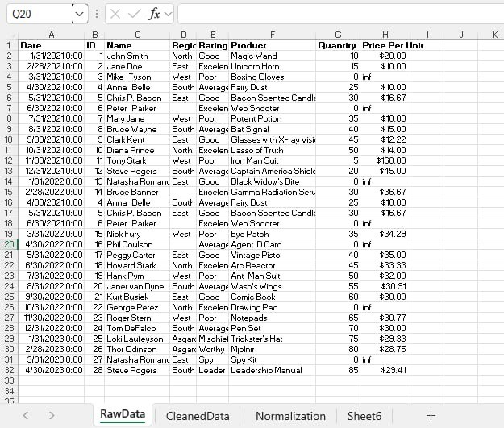
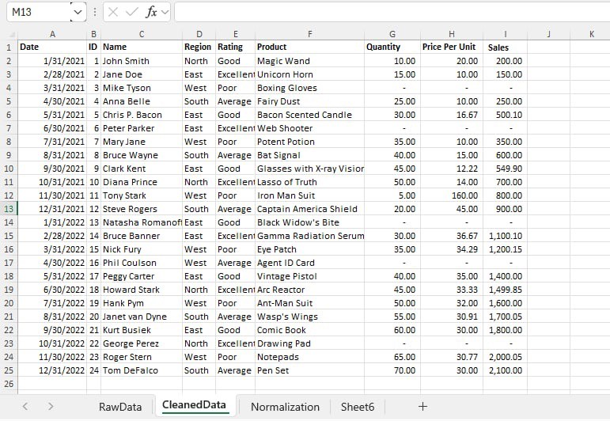
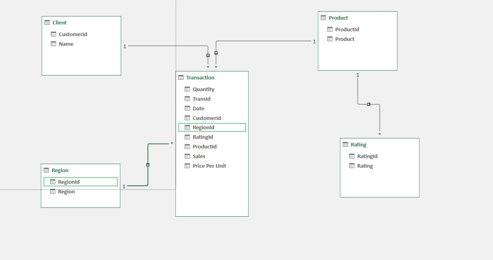

# Step 1 Data Cleaning process
- Load the raw file
- Fit Column and row width and height
- TRIM exra spaces
- Remove NULL Values
- Remove duplicates
# Step 2 Normalization 
- Performed 1NF
- Perform Table split using 2NF
- Perform 3 NF
- Mapped the Normalized tables as a Physical Data Model
# Step 3 Here's the screenshot of my output before i started data cleaning (See Screenshot)

# Step 4 Here's the screenshot of my output after i started data cleaning (See Screenshot)

# Here's the Physical Data Model

